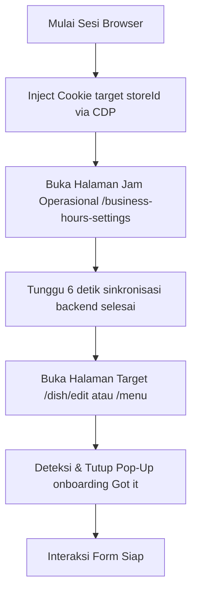

# Dokumentasi Sinkronisasi & Perpindahan Store Shopee Partner

Dokumen ini menjelaskan mekanisme perpindahan (switch) store pada portal Shopee Partner yang berhasil diimplementasikan untuk mengatasi error *“Gagal mendapatkan info toko”* atau *“Maaf tidak dapat menemukan data”* ketika menjalankan bot otomasi menu.

---

## 1. Analisis Masalah (Root Cause)

Saat pengguna menggunakan browser untuk berpindah store secara manual melalui dropdown di UI, portal Shopee Partner melakukan serangkaian tindakan di latar belakang:
1. Mengubah nilai cookie **`shopee_tob_entity_id`** ke ID store yang baru.
2. Memanggil endpoint internal berikut untuk menyinkronkan context sesi aktif di server (Shopee Gateway / SGW):
   * `GET https://foody.shopee.co.id/api/seller/store`
   * `GET https://foody.shopee.co.id/api/seller/store/head-store/check-store`
   * `GET https://foody.shopee.co.id/api/seller/account-role`

Jika bot langsung menavigasi ke halaman produk/menu spesifik suatu store (misal: `/dish/edit?id=...&storeId=...`) tanpa melakukan sinkronisasi server terlebih dahulu, server SGW akan mendeteksi ketidakcocokan context (session mismatch) dan mengembalikan error `auth_failed` (code 3004), menyebabkan halaman blank atau memicu dialog error di UI.

Selain itu, pemanggilan langsung menggunakan `fetch()` via JavaScript konsol dari domain `partner.shopee.co.id` ke `foody.shopee.co.id` akan diblokir oleh CORS (*TypeError: Failed to fetch*) jika tidak menyertakan header khusus dan opsi `credentials: 'include'`.

---

## 2. Solusi yang Berhasil Diimplementasikan

Solusi terbaik dan paling stabil untuk menyinkronkan sesi store di browser tanpa terbentur masalah CORS adalah dengan memanfaatkan **halaman internal Shopee yang secara alami memicu pemanggilan API sinkronisasi tersebut**, yaitu halaman **Business Hours Settings**.

Alur perpindahan store yang aman dan berhasil diimplementasikan:



### Langkah demi Langkah:
1. **CDP Cookie Injection**: Menggunakan Chrome DevTools Protocol (`Network.setCookie`) untuk menyisipkan/mengganti cookie `shopee_tob_entity_id` pada domain `.shopee.co.id` dan `partner.shopee.co.id` sebelum memuat halaman sensitif.
2. **Pemicu Alami (Trigger Page)**: Membuka URL `https://partner.shopee.co.id/settings/shopee-food/business-hours-settings`. Halaman ini secara otomatis melakukan fetch ke API store dengan context cookie baru, sehingga server Shopee memperbarui status store yang aktif pada session token.
3. **Pembersihan Pop-Up**: Setelah navigasi ke halaman menu, bot mendeteksi popup *onboarding* / panduan yang sering muncul saat berganti store (seperti tombol orange bertuliskan `"Got it!"` or `"Mengerti"`) dan mengkliknya secara otomatis sebelum berinteraksi dengan form.

---

## 3. Implementasi Kode Utama

Berikut potongan kode penanganan sinkronisasi dan penutupan popup di `shopee/core/edit.py`:

```python
def _sync_store_session(driver, store_id: str) -> None:
    """
    Menyinkronkan sesi browser ke target store ID menggunakan CDP cookie injection
    dan memicu halaman Business Hours.
    """
    try:
        # 1. Navigasi ke domain utama terlebih dahulu jika belum berada di sana
        curr_url = driver.current_url
        if "partner.shopee.co.id" not in curr_url:
            print("  [*] Navigasi ke domain partner untuk sinkronisasi cookie...")
            driver.get("https://partner.shopee.co.id/")
            time.sleep(2)
            
        # 2. Inject cookie shopee_tob_entity_id via CDP
        print(f"  [*] Mengatur cookie shopee_tob_entity_id = {store_id}...")
        def set_cdp_cookie(name, val, domain):
            driver.execute_cdp_cmd('Network.setCookie', {
                'name': name,
                'value': val,
                'domain': domain,
                'path': '/'
            })

        for domain in [".shopee.co.id", "partner.shopee.co.id"]:
            set_cdp_cookie("shopee_tob_entity_id", store_id, domain)
        time.sleep(1)
        
        # 3. Navigasi ke Business Hours Page untuk memicu sinkronisasi server
        business_hours_url = "https://partner.shopee.co.id/settings/shopee-food/business-hours-settings"
        print(f"  [*] Navigasi ke Business Hours settings page untuk menyinkronkan sesi di server...")
        driver.get(business_hours_url)
        time.sleep(6)
        
    except Exception as e:
        print(f"  [WARN] Gagal menyinkronkan sesi store di browser: {e}")

def _dismiss_popups(driver) -> None:
    """
    Mencari dan mengklik tombol penutup pop-up (seperti 'Got it', 'Mengerti', dll)
    agar tidak menghalangi interaksi UI.
    """
    try:
        # Cari tombol penutup pop-up yang umum (Case-Insensitive friendly)
        buttons = driver.find_elements(By.XPATH, (
            "//button["
            "contains(text(), 'Got it') or contains(., 'Got it') or "
            "contains(text(), 'Got It') or contains(., 'Got It') or "
            "contains(text(), 'Mengerti') or contains(., 'Mengerti') or "
            "contains(text(), 'Tutup') or contains(., 'Tutup') or "
            "contains(text(), 'Ok') or contains(., 'Ok') or "
            "contains(text(), 'OK') or contains(., 'OK')]"
        ))
        for btn in buttons:
            if btn.is_displayed():
                print(f"  [+] Menutup pop-up: '{btn.text}'")
                driver.execute_script("arguments[0].click();", btn)
                time.sleep(1.5)
                break
                
        # Cek ikon close (X)
        close_icons = driver.find_elements(By.CSS_SELECTOR, (
            ".ant-tour-close, .ant-modal-close, .shopee-modal__close, "
            ".ant-modal-close-x, .ant-tour-close-x"
        ))
        for icon in close_icons:
            if icon.is_displayed():
                print("  [+] Menutup modal via ikon silang")
                driver.execute_script("arguments[0].click();", icon)
                time.sleep(1.5)
                break
    except Exception as e:
        print(f"  [DEBUG] Error saat mencoba menutup pop-up: {e}")
```

---

## 4. Panduan Troubleshooting Sesi

Jika di masa mendatang terjadi error *“Gagal mendapatkan info toko”* lagi:
1. **Periksa Validitas Token**: Jalankan pengujian API manual untuk memastikan token `shopee_tob_token` di file session JSON belum kedaluwarsa.
2. **Periksa Struktur Pop-Up Baru**: Jika Shopee merilis panduan tour baru dengan tombol penutup berlabel berbeda, tambahkan teks tombol tersebut ke dalam XPath fungsi `_dismiss_popups`.
3. **Tambahkan Delay**: Jika koneksi server sedang lambat, tingkatkan waktu tunggu (`time.sleep`) setelah membuka halaman *Business Hours* (dari 6 detik menjadi 10 detik) agar server memiliki waktu cukup untuk menyelesaikan pemrosesan sinkronisasi.
