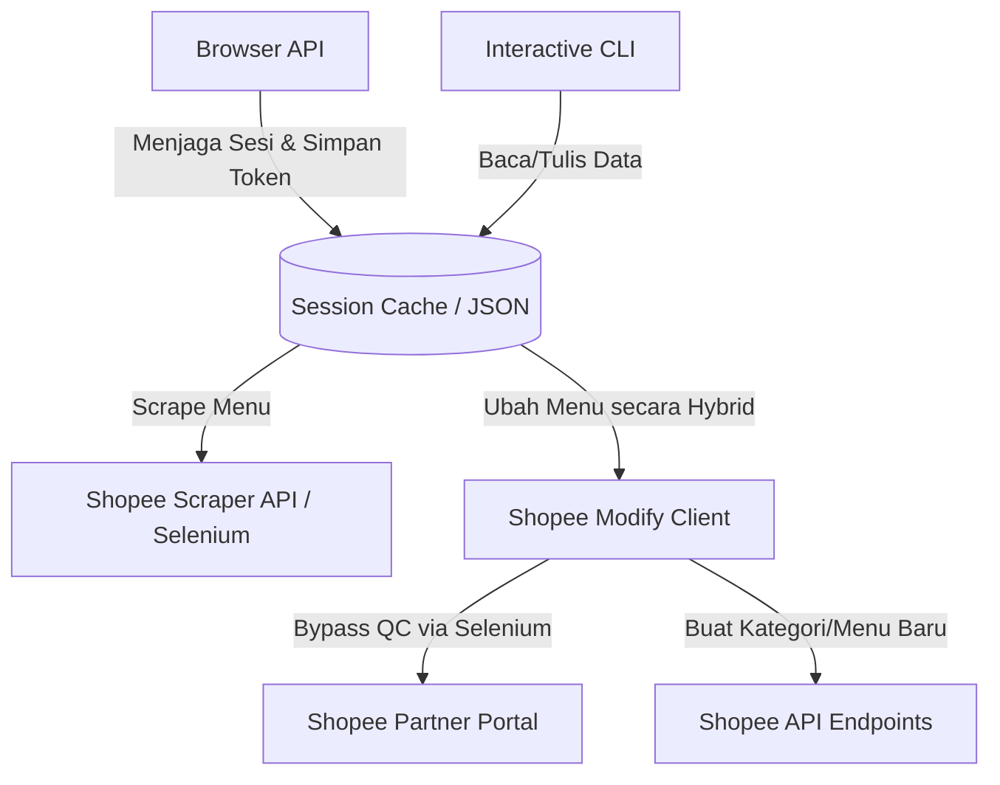
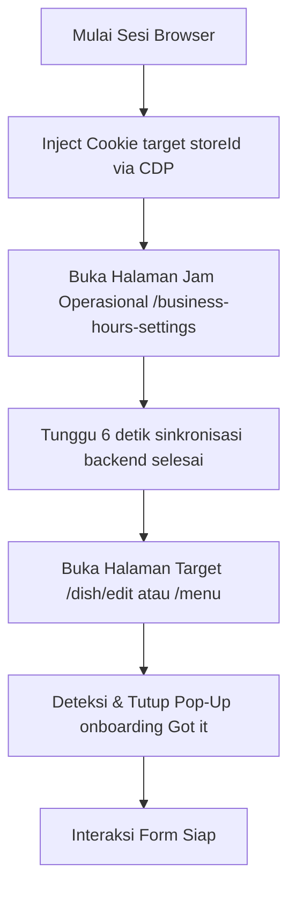

# Panduan Lengkap Otomasi Menu & Modifier ShopeeFood

Dokumen ini menggabungkan seluruh arsitektur, mekanisme perpindahan store, dan pengelolaan modifier untuk sistem otomasi ShopeeFood pada codebase ini (terfokus pada `shopee/core/` dan `browser.py`).

---

## 1. Arsitektur & Kapabilitas Otomasi ShopeeFood

### A. Alur Arsitektur Otomasi

Sistem otomasi ShopeeFood terdiri dari komponen-komponen berikut:



### B. Kapabilitas Utama (Features & Capabilities)

#### 1. Ekstraksi Menu & Modifiers (Scraping)
* **File Utama**: `shopee/core/pull.py` & `shopee/core/adapter.py`
* **Mekanisme**: Hybrid (Selenium untuk *authentication & select merchant*, dilanjutkan API call menggunakan `requests` untuk kecepatan).
* **Data yang Ditarik**:
  * **Kategori & Menu**: Nama item, deskripsi, harga sebelum promo, harga setelah promo, nominal/persentase promo, stok flash sale, harga flash sale, ketersediaan item, link foto.
  * **Toppings & Modifiers**: Nama grup pilihan/modifier group, nama pilihan/modifier, tipe pilihan (Tunggal/Ganda), minimal/maksimal pilihan, harga modifier, ketersediaan modifier.

#### 2. Pengelolaan Menu (Add / Edit Menu)
* **File Utama**: `shopee/core/create.py` & `shopee/core/edit.py`
* **Mekanisme**: **Hybrid API + Selenium Portal**. Shopee melarang pengeditan metadata menu langsung via API dengan memblokirnya di gerbang QC (*auto-qc-result restriction*). Oleh karena itu, modul ini menggunakan:
  * **API Call**: Untuk pembuatan kategori baru (`create_category`), update nama kategori (`update_category`), dan pembuatan menu baru tanpa gambar (`create_dish`).
  * **Selenium Portal (`edit_dish_via_portal` / `_sync_store_session`)**: Mengotomatisasi browser Chrome untuk membuka halaman edit menu, melakukan input/ubah data (Nama, Deskripsi, Harga, Ketersediaan Stok), lalu menekan tombol Simpan untuk membypass QC.
  * **Unggah Gambar**: Otomasi browser Chrome untuk mengunggah file foto makanan lokal, mengklik simpan pada modal crop gambar, dan menyimpan formulir edit menu.

#### 3. Pemeliharaan Sesi Akun (Session Keeper)
* **File Utama**: `browser.py`
* **Mekanisme**: Mengotomatiskan login browser Chrome, melacak validitas token `shopee_tob_token`, serta mendukung ekspor-impor sesi aktif agar tidak kedaluwarsa secara otomatis.

---

## 2. Mekanisme Perpindahan Store (Store Switching)

### A. Analisis Masalah (Root Cause)

Saat pengguna menggunakan browser untuk berpindah store secara manual melalui dropdown di UI, portal Shopee Partner melakukan serangkaian tindakan di latar belakang:
1. Mengubah nilai cookie **`shopee_tob_entity_id`** ke ID store yang baru.
2. Memanggil endpoint internal berikut untuk menyinkronkan context sesi aktif di server (Shopee Gateway / SGW):
   * `GET https://foody.shopee.co.id/api/seller/store`
   * `GET https://foody.shopee.co.id/api/seller/store/head-store/check-store`
   * `GET https://foody.shopee.co.id/api/seller/account-role`

Jika bot langsung menavigasi ke halaman produk/menu spesifik suatu store (misal: `/dish/edit?id=...&storeId=...`) tanpa melakukan sinkronisasi server terlebih dahulu, server SGW akan mendeteksi ketidakcocokan context (session mismatch) dan mengembalikan error `auth_failed` (code 3004), menyebabkan halaman blank atau memicu dialog error di UI.

Selain itu, pemanggilan langsung menggunakan `fetch()` via JavaScript konsol dari domain `partner.shopee.co.id` ke `foody.shopee.co.id` akan diblokir oleh CORS (*TypeError: Failed to fetch*) jika tidak menyertakan header khusus dan opsi `credentials: 'include'`.

### B. Solusi yang Berhasil Diimplementasikan

Solusi terbaik dan paling stabil untuk menyinkronkan sesi store di browser tanpa terbentur masalah CORS adalah dengan memanfaatkan **halaman internal Shopee yang secara alami memicu pemanggilan API sinkronisasi tersebut**, yaitu halaman **Business Hours Settings**.

Alur perpindahan store yang aman dan berhasil diimplementasikan:



#### Langkah demi Langkah:
1. **CDP Cookie Injection**: Menggunakan Chrome DevTools Protocol (`Network.setCookie`) untuk menyisipkan/mengganti cookie `shopee_tob_entity_id` pada domain `.shopee.co.id` dan `partner.shopee.co.id` sebelum memuat halaman sensitif.
2. **Pemicu Alami (Trigger Page)**: Membuka URL `https://partner.shopee.co.id/settings/shopee-food/business-hours-settings`. Halaman ini secara otomatis melakukan fetch ke API store dengan context cookie baru, sehingga server Shopee memperbarui status store yang aktif pada session token.
3. **Pembersihan Pop-Up**: Setelah navigasi ke halaman menu, bot mendeteksi popup *onboarding* / panduan yang sering muncul saat berganti store (seperti tombol orange bertuliskan `"Got it!"` or `"Mengerti"`) dan mengkliknya secara otomatis sebelum berinteraksi dengan form.

### C. Implementasi Kode Utama

Berikut potongan kode penanganan sinkronisasi dan penutupan popup di `shopee/core/edit.py`:

```python
def _sync_store_session(driver, store_id: str) -> None:
    """
    Menyinkronkan sesi browser ke target store ID menggunakan CDP cookie injection
    dan memicu halaman Business Hours.
    """
    try:
        # 1. Navigasi ke domain utama terlebih dahulu jika belum berada di sana
        curr_url = driver.current_url
        if "partner.shopee.co.id" not in curr_url:
            print("  [*] Navigasi ke domain partner untuk sinkronisasi cookie...")
            driver.get("https://partner.shopee.co.id/")
            time.sleep(2)
            
        # 2. Inject cookie shopee_tob_entity_id via CDP
        print(f"  [*] Mengatur cookie shopee_tob_entity_id = {store_id}...")
        def set_cdp_cookie(name, val, domain):
            driver.execute_cdp_cmd('Network.setCookie', {
                'name': name,
                'value': val,
                'domain': domain,
                'path': '/'
            })

        for domain in [".shopee.co.id", "partner.shopee.co.id"]:
            set_cdp_cookie("shopee_tob_entity_id", store_id, domain)
        time.sleep(1)
        
        # 3. Navigasi ke Business Hours Page untuk memicu sinkronisasi server
        business_hours_url = "https://partner.shopee.co.id/settings/shopee-food/business-hours-settings"
        print(f"  [*] Navigasi ke Business Hours settings page untuk menyinkronkan sesi di server...")
        driver.get(business_hours_url)
        time.sleep(6)
        
    except Exception as e:
        print(f"  [WARN] Gagal menyinkronkan sesi store di browser: {e}")

def _dismiss_popups(driver) -> None:
    """
    Mencari dan mengklik tombol penutup pop-up (seperti 'Got it', 'Mengerti', dll)
    agar tidak menghalangi interaksi UI.
    """
    try:
        # Cari tombol penutup pop-up yang umum (Case-Insensitive friendly)
        buttons = driver.find_elements(By.XPATH, (
            "//button["
            "contains(text(), 'Got it') or contains(., 'Got it') or "
            "contains(text(), 'Got It') or contains(., 'Got It') or "
            "contains(text(), 'Mengerti') or contains(., 'Mengerti') or "
            "contains(text(), 'Tutup') or contains(., 'Tutup') or "
            "contains(text(), 'Ok') or contains(., 'Ok') or "
            "contains(text(), 'OK') or contains(., 'OK')]"
        ))
        for btn in buttons:
            if btn.is_displayed():
                print(f"  [+] Menutup pop-up: '{btn.text}'")
                driver.execute_script("arguments[0].click();", btn)
                time.sleep(1.5)
                break
                
        # Cek ikon close (X)
        close_icons = driver.find_elements(By.CSS_SELECTOR, (
            ".ant-tour-close, .ant-modal-close, .shopee-modal__close, "
            ".ant-modal-close-x, .ant-tour-close-x"
        ))
        for icon in close_icons:
            if icon.is_displayed():
                print("  [+] Menutup modal via ikon silang")
                driver.execute_script("arguments[0].click();", icon)
                time.sleep(1.5)
                break
    except Exception as e:
        print(f"  [DEBUG] Error saat mencoba menutup pop-up: {e}")
```

### D. Panduan Troubleshooting Sesi

Jika di masa mendatang terjadi error *“Gagal mendapatkan info toko”* lagi:
1. **Periksa Validitas Token**: Jalankan pengujian API manual untuk memastikan token `shopee_tob_token` di file session JSON belum kedaluwarsa.
2. **Periksa Struktur Pop-Up Baru**: Jika Shopee merilis panduan tour baru dengan tombol penutup berlabel berbeda, tambahkan teks tombol tersebut ke dalam XPath fungsi `_dismiss_popups`.
3. **Tambahkan Delay**: Jika koneksi server sedang lambat, tingkatkan waktu tunggu (`time.sleep`) setelah membuka halaman *Business Hours* (dari 6 detik menjadi 10 detik) agar server memiliki waktu cukup untuk menyelesaikan pemrosesan sinkronisasi.

---

## 3. Eksplorasi & Strategi Modifier/Topping

### A. Analisis API Modifier (Read/Search)
Berdasarkan analisis log API, endpoint pencarian modifier adalah:
* **Request URL**: `POST https://foody.shopee.co.id/api/seller/store/option-groups/search`
* **Payload**: `{"keyword": "", "page_num": 0, "page_size": 10}`

#### Struktur Response JSON & Representasi Data
Setiap item dalam `option_groups` memiliki dua bagian utama:
1. **`option_group`**: Menyimpan konfigurasi grup topping/pilihan.
   * `id`: ID unik grup modifier (string).
   * `name`: Nama grup (misal: `"Ukuran"`, `"Topping"`).
   * `select_mode`: Mode pemilihan (`1` = Pilihan Tunggal, `5` = Pilihan Ganda).
   * `select_min` & `select_max`: Batas minimal dan maksimal pilihan customer.
   * `shelve_state`: Status aktif grup (`1` = Aktif, `0` = Nonaktif).
2. **`options`**: Array dari pilihan/topping di dalam grup tersebut.
   * `id`: ID unik item topping.
   * `name`: Nama topping (misal: `"Jumbo"`, `"Cokelat"`).
   * `price`: Harga topping (dalam unit Shopee, dibagi `100000` untuk Rupiah). Contoh: `"500000000"` = Rp 5.000.
   * `available`: Status ketersediaan stok topping (`1` = Tersedia, `0` = Habis).

### B. Deduksi API untuk Write / Update
Shopee Seller API menggunakan pola REST plural. Dibandingkan dengan modul kategori/catalog:
* **Modifier (Option Group)**:
  * Get: `POST /api/seller/store/option-groups/search`
  * **Create (Deduksi)**: `POST /api/seller/store/option-groups`
  * **Update (Deduksi)**: `POST /api/seller/store/option-groups/{option_group_id}`

#### Estimasi Payload Pembuatan/Pengeditan via API
```json
{
  "option_group": {
    "name": "Level Pedas",
    "remark": "Pilih tingkat kepedasan",
    "select_mode": 1,
    "select_min": 1,
    "select_max": 1,
    "shelve_state": 1
  },
  "options": [
    {
      "name": "Level 1",
      "price": "0",
      "available": 1,
      "rank": 1
    },
    {
      "name": "Level 2",
      "price": "100000000",
      "available": 1,
      "rank": 2
    }
  ]
}
```

### C. Strategi Otomatisasi Web Portal (Selenium)

Apabila pengubahan modifier via API murni terhambat oleh verifikasi keamanan QC Shopee, alur otomatisasi browser Selenium dapat menggunakan URL langsung:

#### 1. Alur Pembuatan Modifier Baru
* **URL**: `https://partner.shopee.co.id/shopee-pos/menu-management/option-group/create?storeId={store_id}`
* **Langkah**:
  1. Navigasi ke URL pembuatan.
  2. Input **Nama Grup Pilihan** & pilih **Aturan Pilihan**.
  3. Klik **"Tambah Pilihan"** untuk mengisi nama topping dan harga tambahan.
  4. Klik **"Pilih Menu"** untuk mengaitkan modifier dengan item makanan tertentu.
  5. Klik **"Simpan"**.

#### 2. Alur Pengeditan Modifier Lama
* **URL**: `https://partner.shopee.co.id/shopee-pos/menu-management/option-group/edit?id={option_group_id}&storeId={store_id}`
* **Langkah**:
  1. Navigasi langsung ke URL edit.
  2. Ubah harga/nama pada baris topping yang diinginkan (berdasarkan pencarian elemen input).
  3. Toggle ketersediaan opsi jika diperlukan.
  4. Klik **"Simpan"**.

### D. Rencana Tahapan Implementasi Modifier
1. **Fase 1: Uji Coba API Tulis (Write API)**
   * Membuat script uji coba untuk menembak `POST /api/seller/store/option-groups` menggunakan cookies dari session aktif untuk memverifikasi apakah request terhambat oleh QC.
2. **Fase 2: Pembuatan Selenium Engine**
   * Menambahkan helper `edit_option_group_via_portal` dan `create_option_group_via_portal` di modul edit/create sebagai fallback jika API murni terhambat.
3. **Fase 3: Integrasi Adapter**
   * Mengintegrasikan fungsi penarikan (*pull*) dan pengiriman (*push*) modifier ke dalam `shopee/core/adapter.py`.

---

## 4. Antarmuka Pengguna CLI (Command Line Interface)

* **File**: `cli.py`
* **Mekanisme**: Form interaktif berbasis terminal yang terhubung dengan modul otomasi Shopee Food:
  1. **Lihat daftar menu**: Menampilkan tabel menu (Nama, Harga, Ketersediaan, Status Tampilan, Kategori).
  2. **Tambah menu baru**: Form interaktif untuk memilih kategori, input nama, harga, deskripsi, stok, visibilitas, dan path file gambar.
  3. **Edit menu**: Memilih baris menu yang ada untuk mengubah data secara interaktif.

---

## 5. Kesimpulan Status Pengembangan

Progres otomasi menu ShopeeFood di codebase ini **sudah siap digunakan (Production-Ready)**. Semua fungsi dasar CRUD (Create, Read, Update, Delete/Hide) telah diimplementasikan:
1. Penarikan data (Scraping) menu lengkap beserta modifier dan promosi/flash sale.
2. Penambahan menu baru dan modifikasi menu eksisting dengan bypass proteksi QC menggunakan metode Selenium hybrid.
3. Monitor sesi untuk menjaga token cookie tidak kedaluwarsa secara otomatis.
4. Tersedia antarmuka CLI interaktif untuk eksekusi langsung dari terminal.
