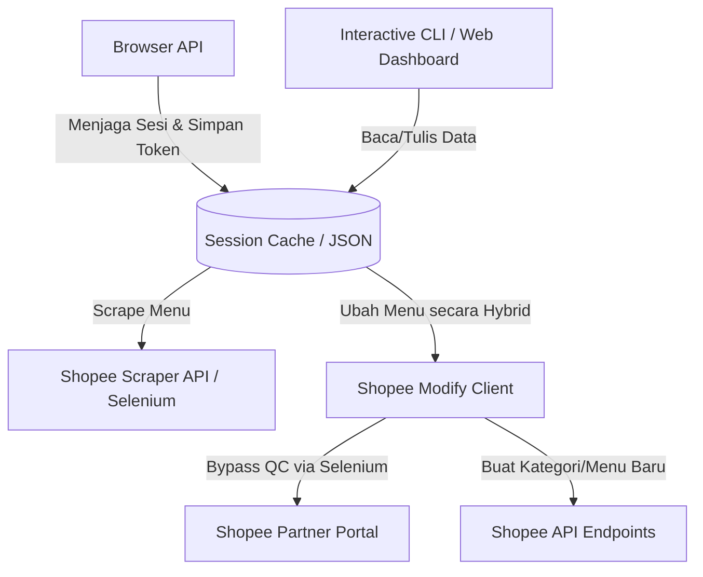

# ShopeeFood Menu Automation - Status & Capabilities

Berdasarkan analisis mendalam terhadap codebase, berikut adalah arsitektur, progres pengerjaan, dan kapabilitas yang telah diimplementasikan untuk sistem otomasi **ShopeeFood Menu** pada folder `shopee/core/` dan `browser.py`.

---

## 1. Arsitektur Otomasi ShopeeFood

Sistem otomasi ShopeeFood terdiri dari empat komponen utama:

---

## 2. Kapabilitas Utama (Features & Capabilities)

### A. Ekstraksi Menu & Modifiers (Scraping)
* **File Utama**: `shopee/core/pull.py` & `shopee/core/adapter.py`
* **Mekanisme**: Hybrid (Selenium untuk *authentication & select merchant*, dilanjutkan API call menggunakan `requests` untuk kecepatan).
* **Data yang Ditarik**:
  * **Kategori & Menu**: Nama item, deskripsi, harga sebelum promo, harga setelah promo (harga coret), nominal/persentase promo, stok flash sale, harga flash sale, ketersediaan item, link foto.
  * **Toppings & Modifiers**: Nama grup pilihan/modifier group, nama pilihan/modifier, tipe pilihan (Tunggal/Ganda), minimal/maksimal pilihan, harga modifier, ketersediaan modifier.

### B. Pengelolaan Menu (Add / Edit Menu)
* **File Utama**: `shopee/core/create.py` & `shopee/core/edit.py`
* **Mekanisme**: **Hybrid API + Selenium Portal**. Shopee melarang pengeditan metadata menu langsung via API dengan memblokirnya di gerbang QC (*auto-qc-result restriction*). Oleh karena itu, modul ini menggunakan:
  * **API Call**: Untuk pembuatan kategori baru (`create_category`), update nama kategori (`update_category`), dan pembuatan menu baru tanpa gambar (`create_dish`).
  * **Selenium Portal (`edit_dish_via_portal` / `_sync_store_session`)**: Mengotomatisasi browser Chrome untuk membuka halaman edit menu, melakukan input/ubah data (Nama, Deskripsi, Harga, Ketersediaan Stok), lalu menekan tombol Simpan untuk membypass QC.
  * **Unggah Gambar**: Otomasi browser Chrome untuk mengunggah file foto makanan lokal, mengklik simpan pada modal crop gambar, dan menyimpan formulir edit menu.

### C. Pemeliharaan Sesi Akun (Session Keeper)
* **File Utama**: `browser.py`
* **Mekanisme**: Mengotomatiskan login browser Chrome, melacak validitas token `shopee_tob_token`, serta mendukung ekspor-impor sesi aktif agar tidak kedaluwarsa secara otomatis.

---

## 3. Jalur Akses Pengguna (User Interfaces)

### A. Interactive CLI (Command Line Interface)
* **File**: `cli.py`
* **Menu Pilihan**: Opsi kelola menu ShopeeFood yang memiliki menu:
  1. **Lihat daftar menu**: Menampilkan tabel menu (Nama, Harga, Ketersediaan, Status Tampilan, Kategori).
  2. **Tambah menu baru**: Form interaktif untuk memilih kategori, input nama, harga, deskripsi, stok, visibilitas, dan path file gambar.
  3. **Edit menu**: Memilih baris menu yang ada untuk mengubah data secara interaktif.

### B. Web App & Dashboard (FastAPI Backend)
* **File**: `app.py`
* **Status**: Database SQLite (`menu_management.db`) menyimpan replika lokal kategori & menu.
* **Fitur**:
  * Menarik data outlet (`GET /api/outlets`).
  * Menarik list menu ke lokal (`POST /api/outlets/{store_id}/pull`).
  * Mengedit menu secara lokal (`POST /api/dishes/{dish_id}/update`).
  * Penyesuaian harga massal (`POST /api/dishes/bulk-price`) berdasarkan nominal atau persentase (contoh: `+10%`, `-2000`).
  * Toggle ketersediaan/visibilitas lokal.
  * Sinkronisasi massal balik ke Shopee.

---

## 4. Kesimpulan Status Pengembangan

Progres otomasi menu ShopeeFood di codebase ini **sudah sangat matang dan lengkap (Production-Ready)**. Semua fungsi dasar CRUD (Create, Read, Update, Delete/Hide) telah diimplementasikan:
1. Penarikan data (Scraping) menu lengkap beserta modifier dan promosi/flash sale.
2. Penambahan menu baru dan modifikasi menu eksisting dengan bypass proteksi QC menggunakan metode Selenium hybrid.
3. Sinkronisasi data dari local database (SQLite) ke ShopeeFood Server.
4. Monitor sesi untuk menjaga token cookie tidak kedaluwarsa secara otomatis.
5. Tersedia dua antarmuka (CLI interaktif dan FastAPI Dashboard API).
