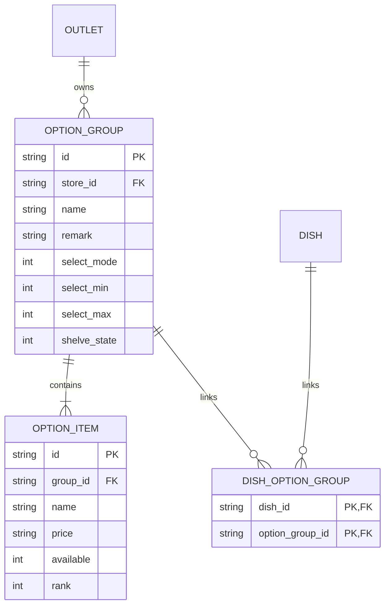

# 🔍 ShopeeFood Modifier Automation Exploration

Dokumentasi ini menganalisis kapabilitas manajemen modifier/topping pada platform ShopeeFood Merchant berdasarkan data log API terbaru yang diberikan dan pola arsitektur codebase saat ini.

---

## 1. Analisis API Modifier (Read/Search)
Berdasarkan log di `shopee/docs/API/modifier/list-option-grup-response.json`, endpoint pencarian modifier adalah:
* **Request URL**: `POST https://foody.shopee.co.id/api/seller/store/option-groups/search`
* **Payload**: `{"keyword": "", "page_num": 0, "page_size": 10}`

### Struktur Response JSON & Representasi Data
Setiap item dalam `option_groups` memiliki dua bagian utama:
1. **`option_group`**: Menyimpan konfigurasi grup topping/pilihan.
   * `id`: ID unik grup modifier (string).
   * `name`: Nama grup (misal: `"Ukuran"`, `"Topping"`, `"Suhu"`).
   * `select_mode`: Mode pemilihan. Dari data:
     * `1` = Pilihan Tunggal (Single Select, min=1, max=1)
     * `5` = Pilihan Ganda (Multi Select, min=0, max=unlimited)
   * `select_min` & `select_max`: Batas minimal dan maksimal pilihan customer.
   * `shelve_state`: Status aktif grup (`1` = Aktif/Ditampilkan, `0` = Nonaktif/Disembunyikan).
2. **`options`**: Array dari pilihan/topping di dalam grup tersebut.
   * `id`: ID unik item topping.
   * `name`: Nama topping (misal: `"Jumbo"`, `"Cokelat"`, `"Es"`).
   * `price`: Harga topping dalam unit Shopee (dibagi `100000` untuk mendapatkan Rupiah). Contoh: `"500000000"` = Rp 5.000.
   * `available`: Status ketersediaan stok topping (`1` = Tersedia, `0` = Habis).

---

## 2. Deduksi API untuk Write / Update
Shopee Seller API menggunakan pola REST plural yang sangat konsisten. Jika kita membandingkannya dengan modul kategori/catalog di codebase:
* **Kategori**:
  * Get: `GET /api/seller/store/dishes` (katalog didapat di response ini)
  * Create: `POST /api/seller/store/catalogs`
  * Update: `POST /api/seller/store/catalogs/{catalog_id}`
* **Modifier (Option Group)**:
  * Get: `POST /api/seller/store/option-groups/search`
  * **Create (Deduksi)**: `POST /api/seller/store/option-groups`
  * **Update (Deduksi)**: `POST /api/seller/store/option-groups/{option_group_id}`

### Estimasi Payload Pembuatan/Pengeditan via API
Payload yang dikirimkan kemungkinan besar memiliki struktur simetris dengan response baca:
```json
{
  "option_group": {
    "name": "Level Pedas",
    "remark": "Pilih tingkat kepedasan",
    "select_mode": 1,
    "select_min": 1,
    "select_max": 1,
    "shelve_state": 1
  },
  "options": [
    {
      "name": "Level 1",
      "price": "0",
      "available": 1,
      "rank": 1
    },
    {
      "name": "Level 2",
      "price": "100000000",
      "available": 1,
      "rank": 2
    }
  ]
}
```

---

## 3. Strategi Otomatisasi Web Portal (Selenium)
Apabila pengubahan modifier via API murni terhambat oleh verifikasi keamanan QC Shopee (seperti halnya menu utama), kita dapat menggunakan automasi browser Selenium dengan memanfaatkan URL langsung (*direct URL*) yang telah diidentifikasi:

### A. Alur Pembuatan Modifier Baru
* **URL**: `https://partner.shopee.co.id/shopee-pos/menu-management/option-group/create?storeId={store_id}`
* **Alur Langkah Selenium**:
  1. Navigasi ke URL pembuatan.
  2. Input **Nama Grup Pilihan** (misal: "Topping Tambahan").
  3. Pilih **Aturan Pilihan** (Pilihan Tunggal / Pilihan Ganda).
  4. Isi batas min/max jika memilih Pilihan Ganda.
  5. Klik tombol **"Tambah Pilihan"** untuk memasukkan opsi baru (mengisi nama topping dan harga tambahan).
  6. Klik **"Pilih Menu"** untuk mengaitkan (*binding*) modifier ini dengan hidangan tertentu.
  7. Klik tombol **"Simpan"** (confirm modal).

### B. Alur Pengeditan Modifier Lama
* **URL**: `https://partner.shopee.co.id/shopee-pos/menu-management/option-group/edit?id={option_group_id}&storeId={store_id}`
* **Alur Langkah Selenium**:
  1. Navigasi langsung ke URL edit dengan menyertakan `id` modifier group.
  2. Ubah harga/nama pada baris topping yang diinginkan (mencari elemen input berdasarkan index baris atau nama opsi).
  3. Toggle status ketersediaan (tersedia/habis) jika diperlukan.
  4. Klik **"Simpan"**.

---

## 4. Usulan Desain Skema Database (`app.py`)
Agar modifier dapat dikelola melalui dashboard lokal dan disinkronkan ke platform, skema SQLite lokal perlu diperluas dengan menambahkan tabel berikut:



### Implementasi Model di SQLAlchemy (`app.py`)
```python
class OptionGroup(Base):
    __tablename__ = "option_groups"
    id = Column(String, primary_key=True)
    store_id = Column(String, ForeignKey("outlets.store_id"))
    name = Column(String, nullable=False)
    remark = Column(String, default="")
    select_mode = Column(Integer, default=1)
    select_min = Column(Integer, default=1)
    select_max = Column(Integer, default=1)
    shelve_state = Column(Integer, default=1)

class OptionItem(Base):
    __tablename__ = "option_items"
    id = Column(String, primary_key=True)
    group_id = Column(String, ForeignKey("option_groups.id"))
    name = Column(String, nullable=False)
    price = Column(String, default="0")
    available = Column(Integer, default=1)
    rank = Column(Integer, default=1)

class DishOptionGroup(Base):
    __tablename__ = "dish_option_groups"
    dish_id = Column(String, ForeignKey("dishes.id"), primary_key=True)
    option_group_id = Column(String, ForeignKey("option_groups.id"), primary_key=True)
```

---

## 5. Rencana Tahapan Implementasi
Jika diputuskan untuk mulai membangun fitur ini, tahapan kerja yang disarankan adalah:

1. **Fase 1: Uji Coba API Tulis (Write API)**
   * Membuat script scratch untuk menembak `POST /api/seller/store/option-groups` dan `POST /api/seller/store/option-groups/{id}` dengan cookies dari session yang sedang aktif untuk memverifikasi apakah Shopee memblokir request penulisan via API murni atau tidak.
2. **Fase 2: Pembuatan Selenium Engine**
   * Menambahkan helper `edit_option_group_via_portal` dan `create_option_group_via_portal` di modul edit/create sebagai fallback jika API murni terhambat QC.
3. **Fase 3: Migrasi Database & API Dashboard**
   * Melakukan migrasi schema SQLite di `app.py`.
   * Menambahkan endpoint REST di FastAPI untuk melayani request edit harga/status topping dari UI dashboard lokal.
4. **Fase 4: Integrasi Adapter**
   * Mengintegrasikan fungsi penarikan (*pull*) dan pengiriman (*push*) modifier ke dalam `shopee/core/adapter.py`.
